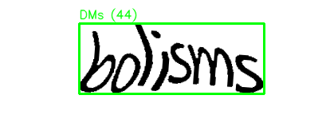
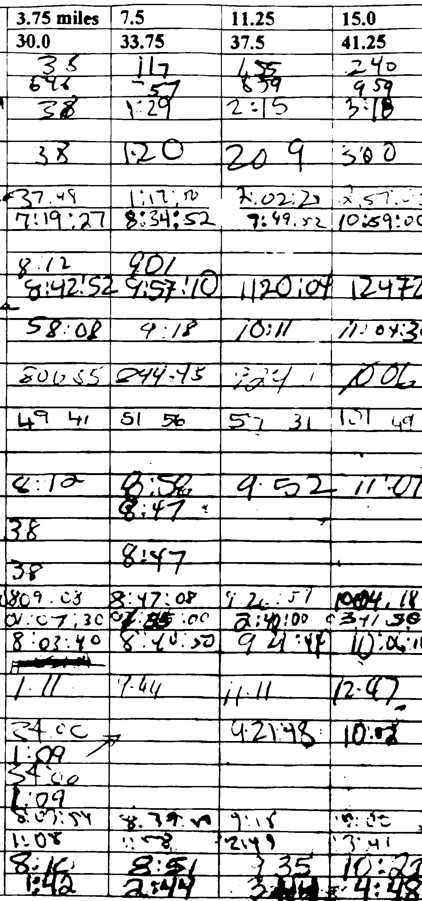
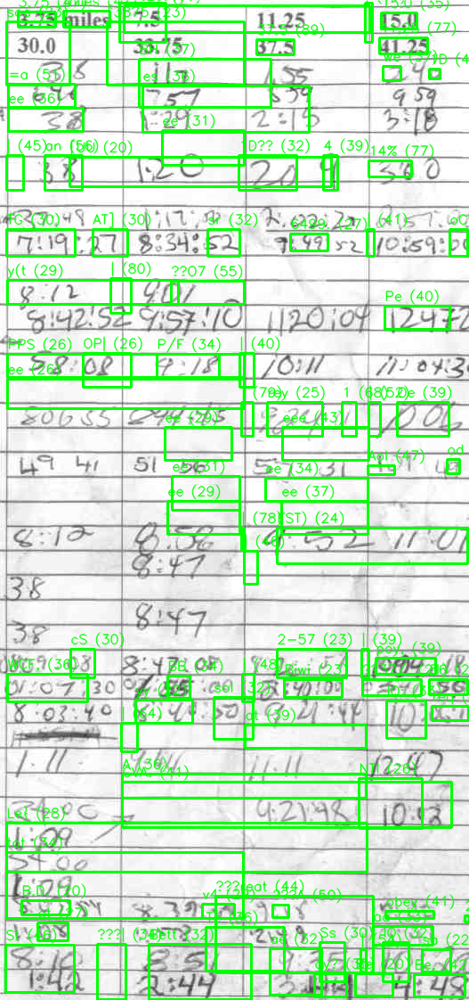
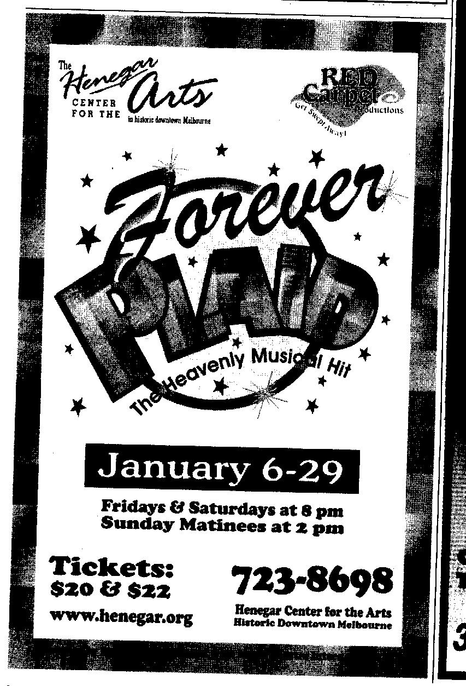
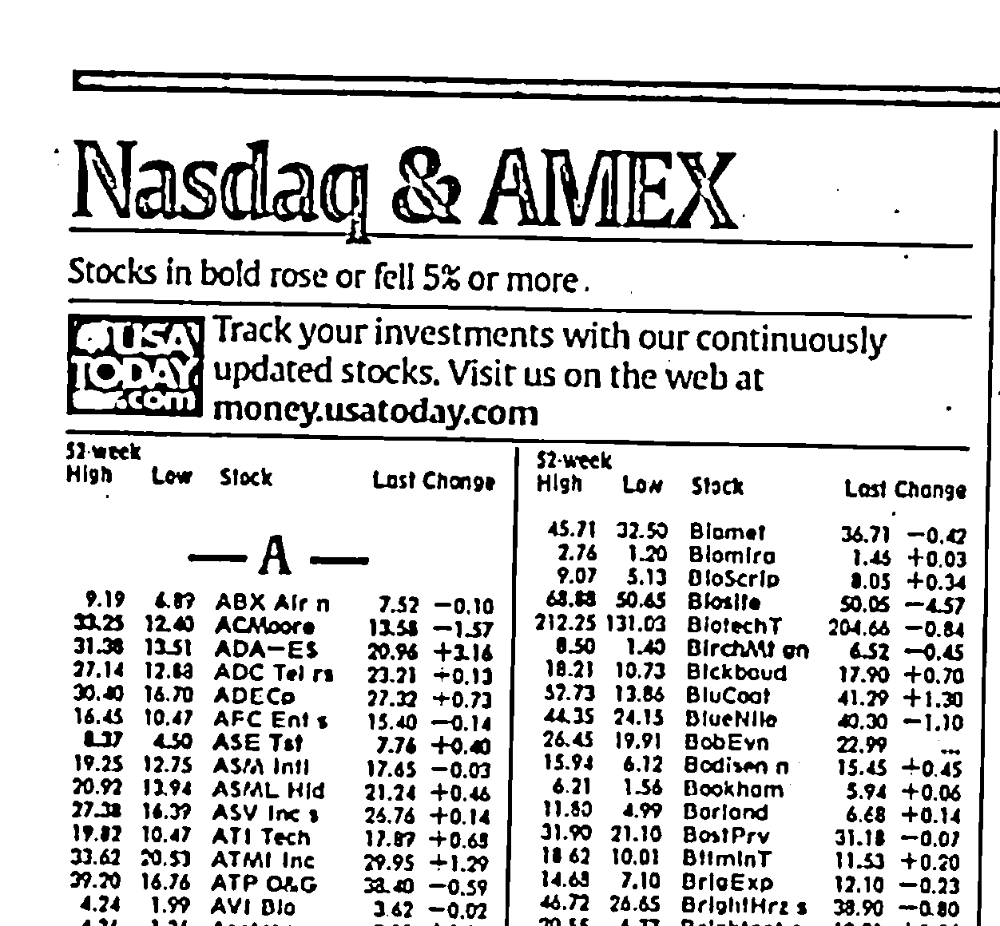
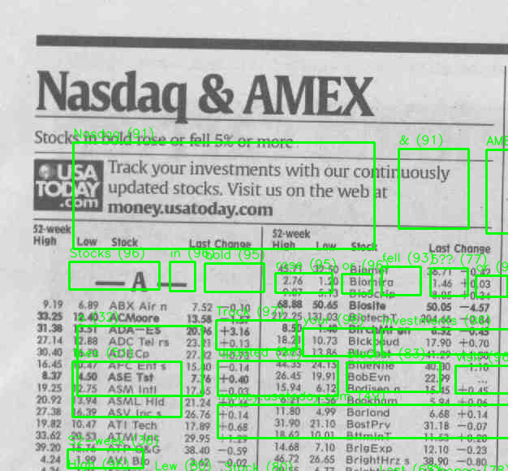

# OCR Text Detection with Automatic Pipeline Selection

This repository implements a practical OCR (Optical Character Recognition) pipeline using **Tesseract OCR** + **OpenCV**.  
Instead of using one fixed preprocessing setting, it **automatically tries multiple preprocessing + PSM configurations** and picks the best one **per image** using confidence-driven heuristics.

---

## What this project produces

For each input image in:

- `data/sample_images/`

the system generates:

- **Extracted text** → `outputs/text/<image_name>.txt`
- **Best preprocessing debug image** → `outputs/viz/<image_name>_<pipeline>_pre.png`
- **OCR bounding boxes visualization** → `outputs/viz/<image_name>_ocr_boxes.png`

> Note: The CSV file `outputs/metrics/ocr_words.csv` is also generated for analysis, but this README focuses on the **visual results**.

---

## How to run

```powershell
python run_ocr.py
```

---

## Example run (your results)

Console output from your run:

```
Processed: captcha2.jpg | pipeline=adapt_deskew_psm11__UNRELIABLE | words_kept=1
Processed: numbers_gs150.jpg | pipeline=otsu_psm4 | words_kept=95
Processed: plaid_bw200.jpg | pipeline=otsu_psm4 | words_kept=20
Processed: stock_gs200q25.jpg | pipeline=adapt_psm11 | words_kept=200
```

---

## Visual Results (with paths)

### 1) CAPTCHA-like image (flagged as unreliable)

**Input**
- `data/sample_images/captcha2.jpg`

**Selected pipeline**
- `adapt_deskew_psm11__UNRELIABLE`

**Best preprocessed output**  
Path: `outputs/viz/captcha2_adapt_deskew_psm11__UNRELIABLE_pre.png`


**OCR bounding boxes**  
Path: `outputs/viz/captcha2_ocr_boxes.png`



---

### 2) Handwritten + printed table

**Input**
- `data/sample_images/numbers_gs150.jpg`

**Selected pipeline**
- `otsu_psm4`

**Best preprocessed output**  
Path: `outputs/viz/numbers_gs150_otsu_psm4_pre.png`



**OCR bounding boxes**  
Path: `outputs/viz/numbers_gs150_ocr_boxes.png`



---

### 3) Poster / stylized text

**Input**
- `data/sample_images/plaid_bw200.jpg`

**Selected pipeline**
- `otsu_psm4`

**Best preprocessed output**  
Path: `outputs/viz/plaid_bw200_otsu_psm4_pre.png`


**OCR bounding boxes**  
Path: `outputs/viz/plaid_bw200_ocr_boxes.png`



---

### 4) Newspaper stock listings

**Input**
- `data/sample_images/stock_gs200q25.jpg`

**Selected pipeline**
- `adapt_psm11`

**Best preprocessed output**  
Path: `outputs/viz/stock_gs200q25_adapt_psm11_pre.png`



**OCR bounding boxes**  
Path: `outputs/viz/stock_gs200q25_ocr_boxes.png`



---

## Notes / limitations (expected behavior)

- **CAPTCHA-like images** are designed to defeat OCR; the system flags these as `__UNRELIABLE`.
- **Handwritten text** is only partially supported with Tesseract; results vary by writing style and image quality.
- Decorative logos and highly stylized fonts may not be recognized perfectly.

---

## Files to commit vs ignore (practical)

Recommended to commit:
- `README.md` (this file)
- `src/`, `run_ocr.py`, `requirements.txt`
- A small number of demo outputs under `outputs/viz/` (like the ones shown above)

Recommended to ignore:
- Large/temporary `outputs/` runs beyond a small demo subset
- Large datasets under `data/` (keep only a few sample images)
